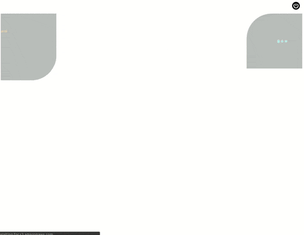

# vue-chat-simulation

Simple UI chat simulation web component with a sender and a recipient



## Setting up

```bash
npm install vue-chat-simulation
```

## Usage

You can use the component as a webcomponent or as a vue component.

### Using as a web component

Add the following to ``head``:

```html
<script src="https://unpkg.com/vue"></script>
<script src="/node_modules/@webcomponents/webcomponentsjs/webcomponents-bundle.js"></script>
<script src="/node_modules/vue-chat-simulation/dist/chat-session.min.js"></script>
```

or as bundle:

```html
<script src="/node_modules/vue-chat-simulation/dist/chat-session.bundle.js"></script>
```

Now you can use the component as web component in your ``HTML`` document with its props and attributes:

```html
<chat-session
    state="true"
    sender-name="Carol"
    sender-avatar="https://i.pravatar.cc/300?img=1"
    sender-box-animation="fadeInLeft"
    recipient-name="Mia"
    recipient-avatar="https://i.pravatar.cc/300?img=20"
    recipient-box-animation="fadeInRight"
    session-theme=""
    awaiting-respond-animation="elastic"
    responded-animation="bounceIn"
    turn-off-button-info="This button closes the chat session"
    :chat-style="{ fontFamily: 'Arial' }"
></chat-session>
```

To provide a chat data, you need to keep registered component in a variable or constant:

```javascript
const Chat = window.ChatSession._wrapper.$refs.inner
```

The chat data format must be in form of either javascript array or parsed JSON as in ``/node_modules/vue-chat-simulation/src/assets/data.js``:

```javascript
export const sampleSessionData = [
    {
        id: 0,
        sender: {
            messages: {
                correct: 'Sample correct typed Message from id 0',
                close: null,
                wrong: 'Sample wrong typed Message from id 0'
            },
            status: 0
        },
        recipient: {
            messages: {
                correct: 'Sample correct typed respond from id 0',
                close: null,
                wrong: 'Sample wrong typed respond from id 0'
            },
            status: 0
        },
        redirect: {
            correct: 1,
            close: null,
            wrong: -1
        },
        respond: null,
        feedback: 'Some optional feedback text for id 0',
        status: 0
    },
    {
        id: 1,
        ...
    },
    ...
]
```

You can override the data as follows:

```javascript
const sampleOverrideData = [
    {
        id: 0,
        sender: {
            messages: {
                correct: 'Sample correct typed Message from id 0',
                close: 'Sample close typed Message from id 0',
                wrong: 'Sample wrong typed Message from id 0'
            },
            status: 0
        },
        recipient: {
            messages: {
                correct: 'Sample correct typed respond from id 0',
                close: 'Sample close typed respond from id 0',
                wrong: 'Sample wrong typed respond from id 0'
            },
            status: 0
        },
        redirect: {
            correct: -1,
            close: -1,
            wrong: -1
        },
        respond: null,
        feedback: 'Some optional feedback text for id 0',
        status: 0
    }
]

Chat.sessionData = sampleOverrideData
```

#### Callbacks

There are some component lifecycle based callbacks and a chat session finished callback

```javascript
Chat.onCreate = () => {
    console.log('Callback tick for onCreate')
}
Chat.onMount = () => {
    console.log('Callback tick for onMount')
}
Chat.onUpdate = () => {
    console.log('Callback tick for onUpdate')
}
Chat.onDestroyed = () => {
    console.log('Callback tick for onDestroyed')
}
Chat.onFinishSession = (redirect, sessions) => {
    console.log('Callback tick for onFinishSession')
    console.log(redirect, sessions)
}
```

### Using as a vue component

For global or local usage of component add the following

```javascript
import ChatSimulation from 'vue-chat-simulation'
```

then register as a component in your component definition:

```javascript
components: [
    ChatSimulation
]
```

and finally use in the template:

```html
<ChatSimulation
    state="true"
    sender-name="Carol"
    sender-avatar="https://i.pravatar.cc/300?img=1"
    sender-box-animation="fadeInLeft"
    recipient-name="Mia"
    recipient-avatar="https://i.pravatar.cc/300?img=20"
    recipient-box-animation="fadeInRight"
    session-theme=""
    awaiting-respond-animation="elastic"
    responded-animation="bounceIn"
    turn-off-button-info="This button closes the chat session"
    :chat-style="{ fontFamily: 'Arial' }"
></ChatSimulation>
```

### Tech stack

- Bootstrap 4
- Vue CLI 3
- webcomponentsjs

### Contribution

Any contribution is welcome. You can play with the vue component (``src/components/ChatSession.vue``) any way you want


### License

ISC
